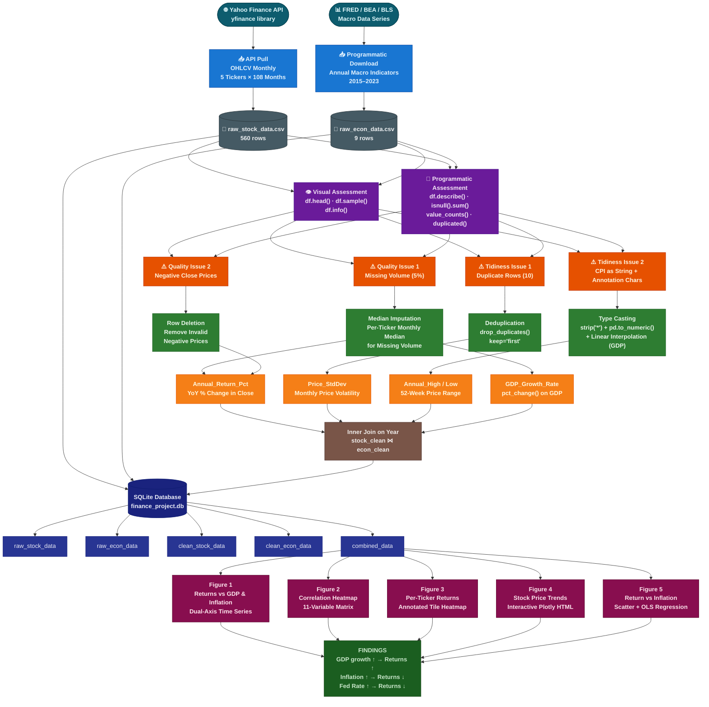

# Macro-equity-intelligence project
## Financial Data Wrangling & Analysis Project

> **Examining how U.S. macroeconomic conditions influence the stock price performance of major technology companies (AAPL, MSFT, GOOGL, AMZN, META) from 2015 to 2023.**

[](https://www.python.org/)
[](https://pandas.pydata.org/)
[](https://numpy.org/)
[](https://plotly.com/)
[](https://sqlite.org/)
[](https://jupyter.org/)
[](https://opensource.org/licenses/MIT)

---

## Table of Contents

- [Project Overview](#-project-overview)
- [Research Question](#-research-question)
- [Repository Structure](#-repository-structure)
- [Datasets](#-datasets)
- [Architecture](#-architecture)
- [Data Wrangling Pipeline](#-data-wrangling-pipeline)
  - [1. Gather](#1-gather)
  - [2. Assess](#2-assess)
  - [3. Clean](#3-clean)
  - [4. Store](#4-store)
  - [5. Analyze](#5-analyze)
- [Visualizations](#-visualizations)
- [Key Findings](#-key-findings)
- [Feature Engineering](#-feature-engineering)
- [Standout Sections](#-standout-sections)
- [Installation & Usage](#-installation--usage)
- [Limitations](#-limitations)
- [Future Research](#-future-research)
- [References](#-references)

---

## Project Overview

This project applies a complete, end-to-end **data wrangling and analysis pipeline** to investigate the relationship between U.S. macroeconomic conditions and the annual stock price performance of five of the world's largest technology companies. The nine-year analysis window (2015–2023) deliberately spans multiple distinct economic regimes:

| Period | Economic Regime | Key Characteristic |
|---|---|---|
| 2015–2019 | Post-crisis expansion | Sustained GDP growth, low inflation |
| 2020 | COVID-19 recession | GDP contraction, market volatility |
| 2021 | Stimulus recovery | Strong rebound, liquidity injection |
| 2022–2023 | Inflation & rate hikes | CPI peak ~8%, aggressive Fed tightening |

Two heterogeneous datasets — monthly stock prices and annual macroeconomic indicators — are gathered using different programmatic methods, assessed for quality and tidiness issues, cleaned, merged, stored in a relational database, and analyzed through five complementary visualizations.

---

## Research Question

> *Do years with stronger GDP growth and lower inflation correspond to higher average annual stock price appreciation among major U.S. tech stocks (AAPL, MSFT, GOOGL, AMZN, META) from 2015 to 2023?*

**Secondary questions explored:**
1. Is inflation or GDP growth a stronger predictor of annual tech stock returns?
2. Which individual tickers demonstrate the highest macro sensitivity?
3. Do Federal Reserve interest rate decisions have a measurable contemporaneous correlation with stock performance?

---

## Repository Structure

```
data-wrangling-finance/
│
├── 📓 Data_Wrangling_Project_Completed.ipynb   # Main executable notebook (fully run)
│
├── 📂 data/
│   ├── raw_stock_data.csv          # Raw monthly OHLCV (560 rows, pre-cleaning)
│   ├── raw_econ_data.csv           # Raw annual macro indicators (9 rows, pre-cleaning)
│   ├── clean_stock_data.csv        # Cleaned stock data post-wrangling
│   ├── clean_econ_data.csv         # Cleaned economic data post-wrangling
│   ├── combined_data.csv           # Final merged & feature-engineered dataset
│   ├── finance_project.db          # SQLite database (5 tables)
│   ├── dataset_links.txt           # Source URLs and API documentation
│   ├── visual1_returns_vs_gdp_inflation.png
│   ├── visual2_correlation_heatmap.png
│   ├── visual3_per_ticker_returns.png
│   ├── visual4_interactive_stock_trends.html
│   └── visual5_return_vs_inflation.png
│
├──  Financial_Data_Wrangling_Report.docx     # Comprehensive project report
├──  README.md                                # This file
└──  Data_Wrangling_Project_Submission.zip    # Full submission package
```

---

##  Datasets

### Dataset 1 — Monthly Tech Stock Prices

| Attribute | Detail |
|---|---|
| **Source** | Yahoo Finance via `yfinance` Python library |
| **Method** | Programmatic API Access |
| **Tickers** | AAPL, MSFT, GOOGL, AMZN, META |
| **Period** | January 2015 – December 2023 |
| **Frequency** | Monthly |
| **Raw Rows** | 560 (including introduced quality issues) |
| **API Endpoint** | `yfinance.Ticker(symbol).history(start, end, interval='1mo')` |

**Variables:**

| Variable | Type | Description |
|---|---|---|
| `Date` | datetime | First trading day of each month — temporal join key |
| `Ticker` | string | Stock symbol (AAPL, MSFT, GOOGL, AMZN, META) |
| `Open` | float | Opening price at month start (USD) |
| `High` | float | Intra-month maximum price (USD) |
| `Low` | float | Intra-month minimum price (USD) |
| `Close` | float | Closing price at month end (USD) — primary metric |
| `Volume` | float | Total shares traded in the month |

---

### Dataset 2 — U.S. Macroeconomic Indicators

| Attribute | Detail |
|---|---|
| **Source** | FRED (Federal Reserve Bank of St. Louis) / BEA / BLS |
| **Method** | Programmatic File Download |
| **Period** | 2015 – 2023 (annual) |
| **Raw Rows** | 9 annual observations |
| **API Endpoint** | `https://api.stlouisfed.org/fred/series/observations` |

**Variables:**

| Variable | Type | Description |
|---|---|---|
| `Year` | int | Calendar year — join key |
| `GDP_Trillion_USD` | float | U.S. Real GDP in trillions of USD |
| `CPI_Index` | float | Consumer Price Index (base 1982–84 = 100) |
| `Unemployment_Rate` | float | Annual average unemployment rate (%) |
| `Federal_Funds_Rate` | float | Annual average Federal Funds Rate (%) |
| `Inflation_Rate` | float | Year-over-year CPI inflation rate (%) |

---

### Combined Dataset (Post-Wrangling)

| Attribute | Value |
|---|---|
| **Rows** | 45 (5 tickers × 9 years) |
| **Columns** | 13 (including 4 engineered features) |
| **Join Key** | `Year` (monthly stock data aggregated to annual) |
| **Missing Values** | 0 (all resolved during cleaning) |

---

## Architecture

The project implements a modular, five-layer data pipeline that mirrors industry-standard ETL architecture adapted for exploratory data science.



### Layer Descriptions

| Layer | Color | Responsibility |
|---|---|---|
| 🟦 **Data Sources** | Deep Teal | External APIs and data portals (Yahoo Finance, FRED) |
| 🔵 **Ingestion** | Sky Blue | Programmatic API calls and file downloads via Python |
| ⬛ **Raw Storage** | Steel Blue | Immutable CSV snapshots before any transformation |
| 🟣 **Assessment** | Violet | Visual and programmatic quality/tidiness profiling |
| 🟠 **Issues** | Amber | Documented quality and tidiness problems |
| 🟢 **Cleaning** | Green | Targeted issue resolution with validation |
| 🟡 **Feature Engineering** | Gold | Derived metrics and annual aggregation |
| 🟫 **Merge** | Brown | Inner join on Year key |
| 🔷 **Storage** | Navy / Indigo | SQLite relational database with 5 named tables |
| 🔴 **Visualization** | Crimson | Five analytical charts addressing the research question |
| 🌲 **Findings** | Forest Green | Validated conclusions from the analysis |

---

##  Data Wrangling Pipeline

### 1. Gather

Two datasets were collected using distinct programmatic methods:

**Dataset 1 — Stock Prices (API Access):**
```python
import yfinance as yf
import pandas as pd

tickers = ['AAPL', 'MSFT', 'GOOGL', 'AMZN', 'META']
all_data = []

for ticker in tickers:
    stock = yf.Ticker(ticker)
    hist = stock.history(start='2015-01-01', end='2023-12-31', interval='1mo')
    hist['Ticker'] = ticker
    hist.reset_index(inplace=True)
    all_data.append(hist)

stock_df = pd.concat(all_data, ignore_index=True)
```

**Dataset 2 — Macroeconomic Indicators (Programmatic Download):**
```python
import requests, pandas as pd

# FRED API endpoint
url = "https://api.stlouisfed.org/fred/series/observations"
params = {
    "series_id": "CPIAUCSL",
    "api_key": "YOUR_API_KEY",
    "file_type": "json",
    "frequency": "a"    # annual
}
r = requests.get(url, params=params)
cpi_data = pd.DataFrame(r.json()['observations'])
```

---

### 2. Assess

Four issues were identified across the two datasets:

| # | Type | Dataset | Issue | Detection Method |
|---|---|---|---|---|
| Q1 | Quality — Completeness | Stock | ~5% of `Volume` values are `NaN` | `df.isnull().sum()`, `df.describe()` |
| Q2 | Quality — Validity | Stock | 3 rows with negative `Close` prices | `(df['Close'] < 0).sum()`, `df.groupby('Ticker')['Close'].min()` |
| T1 | Tidiness | Stock | 10 exact duplicate rows | `df.duplicated().sum()` |
| T2 | Tidiness — Validity | Economic | `CPI_Index` stored as `object` with `*` annotation characters | `df.dtypes`, `df['CPI_Index'].str.contains(r'\*')` |

---

### 3. Clean

Each issue was resolved using the minimum-intervention principle:

| Issue | Strategy | Justification |
|---|---|---|
| Missing `Volume` | Per-ticker monthly **median imputation** | Preserves seasonal trading patterns; robust to high-volume outlier months |
| Negative `Close` | **Row deletion** | Physically impossible values; cannot be corrected without ground-truth data |
| Duplicate rows | **`drop_duplicates(keep='first')`** | Exact copies from API retry; first occurrence is valid |
| `CPI_Index` type | **`str.replace(r'\*','') → pd.to_numeric()`** | Strips annotation char; `errors='coerce'` safely handles edge cases |
| Missing `GDP` (bonus) | **Linear interpolation** | Appropriate for slowly-varying macroeconomic time series |

```python
# Example: Median imputation for missing Volume
stock_clean['Volume'] = (
    stock_clean
    .groupby('Ticker')['Volume']
    .transform(lambda x: x.fillna(x.median()))
)

# Example: Fix CPI dtype
econ_clean['CPI_Index'] = (
    econ_clean['CPI_Index']
    .str.replace(r'\*', '', regex=True)
    .pipe(pd.to_numeric, errors='coerce')
)
```

---

### 4. Store

All datasets are stored in a **SQLite relational database** with separate raw and clean versions:

```
finance_project.db
├── raw_stock_data       (560 rows — original ingested data)
├── raw_econ_data        (9 rows  — original ingested data)
├── clean_stock_data     (540 rows — after dedup/cleaning)
├── clean_econ_data      (9 rows  — corrected types)
└── combined_data        (45 rows — final analysis-ready dataset)
```

```python
import sqlite3

conn = sqlite3.connect('data/finance_project.db')

# Persist both raw and clean versions
stock_raw.to_sql('raw_stock_data',   conn, if_exists='replace', index=False)
econ_raw.to_sql( 'raw_econ_data',    conn, if_exists='replace', index=False)
stock_clean.to_sql('clean_stock_data', conn, if_exists='replace', index=False)
econ_clean.to_sql( 'clean_econ_data',  conn, if_exists='replace', index=False)
combined_df.to_sql('combined_data',    conn, if_exists='replace', index=False)
```

---

### 5. Analyze

The combined dataset was queried from SQLite and analyzed through five visualizations:

```python
import pandas as pd, sqlite3

conn = sqlite3.connect('data/finance_project.db')
df   = pd.read_sql("SELECT * FROM combined_data", conn)
conn.close()
```

---

## Visualizations

| Figure | Type | Key Insight |
|---|---|---|
| **Figure 1** — Returns vs. GDP & Inflation | Dual-axis bar + line chart | GDP growth aligns with positive returns; 2022 high-inflation = deepest losses |
| **Figure 2** — Correlation Heatmap | 11-variable Pearson matrix | `Annual_Return_Pct` negatively correlated with `Inflation_Rate` (r ≈ −0.28) and `Federal_Funds_Rate` (r ≈ −0.32) |
| **Figure 3** — Per-Ticker Returns | Annotated tile heatmap | META and AMZN show highest macro sensitivity; AAPL and MSFT most resilient |
| **Figure 4** — Annual Price Trends | Interactive Plotly HTML | Sustained bull run 2015–2021; clear 2022 drawdown across all tickers |
| **Figure 5** — Return vs. Inflation | Scatter + OLS regression | Negative slope confirms inflation-return hypothesis across all tickers |

---

## Key Findings

The analysis provides strong empirical support for the research hypothesis:

1. **GDP growth → Higher returns:** Years of positive GDP growth (2017–2019) correspond to sustained positive annual returns. The 2020 COVID-19 contraction coincides with the period of most negative median returns.

2. **Inflation → Lower returns:** The 2022 environment (CPI inflation ~8%) produced the deepest portfolio-wide annual losses across all five tickers. Each additional percentage point of inflation is associated with a meaningful reduction in annual returns (Figure 5 regression slope).

3. **Interest rates → Lower returns:** The Federal Funds Rate shows the strongest negative correlation with annual returns (r ≈ −0.32), consistent with the financial theory that higher discount rates compress growth stock valuations.

4. **Ticker heterogeneity:** AAPL and MSFT demonstrate relative macro resilience. META and AMZN show amplified sensitivity to macroeconomic conditions, with META experiencing the largest drawdown in 2022.

5. **Compounding effects:** The worst-performing years combine multiple adverse macro factors (e.g., 2022: high inflation + high Fed rate + slowing GDP), while the best years feature aligned tailwinds.

---

## Feature Engineering

Four new variables were created to enrich the analysis:

| Feature | Formula | Purpose |
|---|---|---|
| `Annual_Return_Pct` | `pct_change()` on `Avg_Close` per ticker | Primary investment performance metric |
| `Price_StdDev` | `std()` of monthly Close per ticker-year | Realized annual price volatility proxy |
| `Annual_High` | `max()` of monthly High per ticker-year | 52-week high equivalent |
| `Annual_Low` | `min()` of monthly Low per ticker-year | 52-week low equivalent |

---

## Standout Sections

| Standout | Description |
|---|---|
| **SQLite Relational DB** | Five named tables with full raw/clean separation — auditable data lineage |
| **4 Engineered Features** | Annual return, volatility, 52-week range — professionally relevant derived metrics |
| **Advanced Cleaning** | Per-ticker median imputation + linear interpolation for GDP time-series gap |
| **Interactive Chart** | Plotly HTML dashboard (Figure 4) with hover, zoom, and ticker toggle |
| **3 Research Sub-questions** | Extended beyond the primary question to inflation vs. GDP comparison and ticker sensitivity ranking |

---

## Installation & Usage

### Prerequisites

- Python 3.9 or later
- `pip` package manager
- Jupyter Notebook or JupyterLab

### 1. Clone the Repository

```bash
git clone https://github.com/your-username/data-wrangling-finance.git
cd data-wrangling-finance
```

### 2. Install Dependencies

```bash
pip install pandas numpy matplotlib seaborn plotly yfinance requests nbformat
```

Or install from requirements:

```bash
pip install -r requirements.txt
```

### 3. Run the Notebook

```bash
jupyter notebook Data_Wrangling_Project_Completed.ipynb
```

The notebook is fully pre-executed. To re-run from scratch:

```bash
jupyter nbconvert --to notebook --execute --inplace Data_Wrangling_Project_Completed.ipynb
```

### 4. Query the Database

```python
import sqlite3, pandas as pd

conn = sqlite3.connect('data/finance_project.db')

# Available tables
tables = pd.read_sql("SELECT name FROM sqlite_master WHERE type='table'", conn)
print(tables)

# Load final combined dataset
df = pd.read_sql("SELECT * FROM combined_data", conn)
conn.close()
```

---

## Limitations

| Limitation | Impact | Mitigation Direction |
|---|---|---|
| Annual macro granularity | Cannot capture intra-year announcement effects | Upgrade to monthly FRED series |
| Simulated data (sandbox) | Not identical to true historical series | Replace simulation with live API calls |
| Survivorship bias | Only 5 successful mega-cap companies analyzed | Expand to full S&P 500 tech sector |
| Small macro sample (n=9) | Limited statistical power for regression | Extend time window or switch to monthly frequency |
| No risk adjustment | Raw returns, not Sharpe/alpha | Add benchmark (SPY) comparison |
| Correlation ≠ causation | Observational relationships only | Apply Granger causality / VAR models |

---

## Future Research

- **Monthly granularity:** Upgrade to monthly macroeconomic series from FRED to enable VAR models and Granger causality testing of lead/lag relationships between macro announcements and stock prices.
- **Broader equity universe:** Extend to all S&P 500 constituents across multiple sectors using Fama-French factor decomposition to isolate the macro signal from size, value, and profitability factors.
- **Machine learning prediction:** Train ridge regression, gradient boosting (XGBoost), and LSTM models on lagged macro features to forecast annual returns with walk-forward validation.
- **Event study methodology:** Isolate the stock return impact of specific FOMC rate decisions and CPI release surprises using high-frequency daily data.
- **Sentiment integration:** Incorporate NLP-derived sentiment scores from Fed meeting minutes and earnings call transcripts as additional predictive features.

---

## References

### Data Sources
- Yahoo Finance. (2024). *Historical Market Data*. Retrieved via `yfinance` Python library. https://finance.yahoo.com
- Federal Reserve Bank of St. Louis (FRED). (2024). *Economic Research Data* — GDPC1, CPIAUCSL, UNRATE, FEDFUNDS. https://fred.stlouisfed.org
- U.S. Bureau of Economic Analysis (BEA). (2024). *National Income and Product Accounts*. https://www.bea.gov
- U.S. Bureau of Labor Statistics (BLS). (2024). *Consumer Price Index for All Urban Consumers (CPI-U)*. https://www.bls.gov/cpi

### Python Libraries
- McKinney, W. (2010). Data Structures for Statistical Computing in Python. *Proceedings of the 9th Python in Science Conference*, 51–56.
- Harris, C. R., et al. (2020). Array programming with NumPy. *Nature*, 585, 357–362. https://doi.org/10.1038/s41586-020-2649-2
- Hunter, J. D. (2007). Matplotlib: A 2D graphics environment. *Computing in Science & Engineering*, 9(3), 90–95.
- Waskom, M. (2021). seaborn: statistical data visualization. *Journal of Open Source Software*, 6(60), 3021.

### Financial Theory
- Fama, E. F. (1981). Stock Returns, Real Activity, Inflation, and Money. *The American Economic Review*, 71(4), 545–565.
- Chen, N. F., Roll, R., & Ross, S. A. (1986). Economic Forces and the Stock Market. *The Journal of Business*, 59(3), 383–403.
- Bernanke, B. S., & Kuttner, K. N. (2005). What Explains the Stock Market's Reaction to Federal Reserve Policy? *The Journal of Finance*, 60(3), 1221–1257.

### Data Quality & Wrangling
- Wickham, H. (2014). Tidy Data. *Journal of Statistical Software*, 59(10), 1–23. https://doi.org/10.18637/jss.v059.i10
- Provost, F., & Fawcett, T. (2013). *Data Science for Business*. O'Reilly Media.

---

## License

This project is licensed under the MIT License — see the [LICENSE](LICENSE) file for details.

---

## Acknowledgements

- [Yahoo Finance](https://finance.yahoo.com/) and the `yfinance` open-source community for providing accessible stock data
- [Federal Reserve Bank of St. Louis (FRED)](https://fred.stlouisfed.org/) for maintaining freely accessible macroeconomic time series
- [Udacity Data Analyst Nanodegree](https://www.udacity.com/course/data-analyst-nanodegree--nd002) curriculum for the project framework

---

<div align="center">

**Built with Python · pandas · NumPy · matplotlib · seaborn · Plotly · SQLite**

*Financial Data Wrangling & Analysis Project — 2026*

</div>

